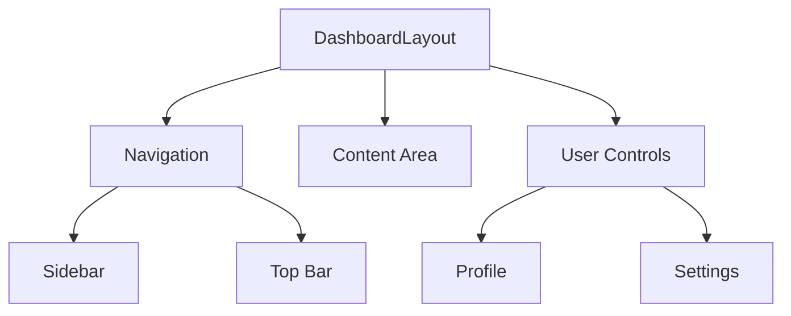

# Dashboard Layout

The Dashboard Layout provides the main application structure with navigation, user controls, and content areas.

## Layout Structure



## Components

### Navigation Bar

The top navigation bar contains:
- Organization switcher
- Search functionality
- User profile menu
- Notifications

### Sidebar

<CodeGroup>

```vue Vue
<template>
  <nav class="sidebar">
    <div class="logo">
      <!-- Logo Component -->
    </div>
    <div class="nav-items">
      <NavItem 
        v-for="item in navigationItems"
        :key="item.path"
        :item="item"
      />
    </div>
    <div class="user-controls">
      <!-- User Controls -->
    </div>
  </nav>
</template>
```

```typescript TypeScript
interface NavigationItem {
  path: string
  label: string
  icon: string
  permissions?: string[]
}
```

</CodeGroup>

### Content Area

The main content area supports:
- Dynamic routing
- Nested layouts
- Responsive design
- Loading states

## Usage

<CodeGroup>

```vue Template
<template>
  <DashboardLayout>
    <template #sidebar>
      <!-- Custom Sidebar Content -->
    </template>
    
    <template #default>
      <!-- Main Content -->
    </template>
    
    <template #footer>
      <!-- Footer Content -->
    </template>
  </DashboardLayout>
</template>
```

```typescript Script
import { DashboardLayout } from '@/layouts'
import { defineComponent } from 'vue'

export default defineComponent({
  components: {
    DashboardLayout
  }
})
```

</CodeGroup>

## Customization

### Theme Options

The layout supports theme customization through CSS variables:

```css
:root {
  --sidebar-width: 280px;
  --header-height: 64px;
  --content-max-width: 1200px;
}
```

### Responsive Breakpoints

```css
/* Mobile */
@media (max-width: 768px) {
  .sidebar {
    transform: translateX(-100%);
  }
}

/* Tablet */
@media (max-width: 1024px) {
  :root {
    --sidebar-width: 240px;
  }
}
```

## Props

| Prop | Type | Default | Description |
|------|------|---------|-------------|
| `fluid` | `boolean` | `false` | Full-width layout |
| `sidebarCollapsed` | `boolean` | `false` | Collapse sidebar |
| `showHeader` | `boolean` | `true` | Show top header |

## Events

| Event | Payload | Description |
|-------|---------|-------------|
| `sidebar-toggle` | `boolean` | Sidebar collapse state changed |
| `layout-ready` | - | Layout mounted and ready |

## Slots

| Name | Description |
|------|-------------|
| `sidebar` | Custom sidebar content |
| `header` | Custom header content |
| `default` | Main content area |
| `footer` | Footer content |

## Best Practices

<Check>Use slot props for dynamic content</Check>
<Check>Implement responsive breakpoints</Check>
<Check>Handle loading states</Check>
<Check>Consider accessibility features</Check>
<Check>Manage state with Pinia store</Check>

## Examples

### Basic Layout

```vue
<template>
  <DashboardLayout>
    <div class="content">
      <h1>Dashboard</h1>
      <div class="widgets">
        <!-- Dashboard Widgets -->
      </div>
    </div>
  </DashboardLayout>
</template>
```

### Custom Navigation

```vue
<template>
  <DashboardLayout>
    <template #sidebar>
      <CustomNavigation 
        :items="navigationItems"
        @item-click="handleNavigation"
      />
    </template>
  </DashboardLayout>
</template>
```

### Nested Layouts

```vue
<template>
  <DashboardLayout>
    <template #default>
      <NestedLayout>
        <!-- Nested Content -->
      </NestedLayout>
    </template>
  </DashboardLayout>
</template>
``` 