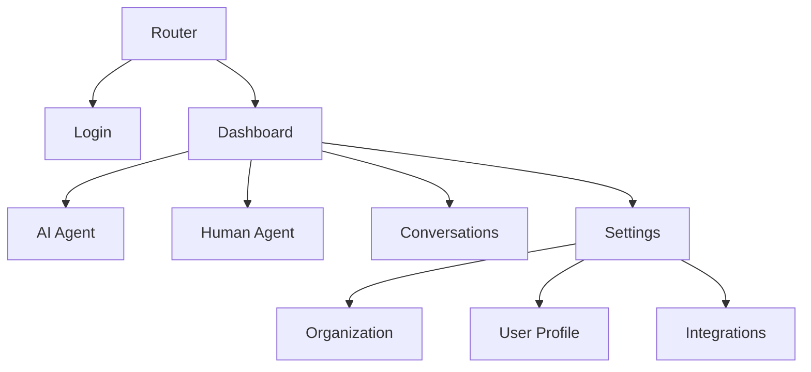

# Views Overview

ChatterMate's frontend is organized into several key views that handle different aspects of the application.

## View Structure



## Core Views

### Authentication Views

<CardGroup cols={2}>
  <Card title="Login" icon="right-to-bracket" href="/views/login">
    User authentication and access control
  </Card>
  <Card title="Setup" icon="gear" href="/views/setup">
    Initial organization and user setup
  </Card>
</CardGroup>

### Agent Views

<CardGroup cols={2}>
  <Card title="AI Agent" icon="robot" href="/views/ai-agent">
    AI-powered conversation handling
  </Card>
  <Card title="Human Agent" icon="user" href="/views/human-agent">
    Human agent dashboard and controls
  </Card>
</CardGroup>

### Management Views

<CardGroup cols={2}>
  <Card title="Conversations" icon="messages" href="/views/conversations">
    Conversation history and management
  </Card>
  <Card title="Settings" icon="sliders" href="/views/settings">
    Application and user settings
  </Card>
</CardGroup>

## Route Configuration

```typescript
const routes: RouteRecordRaw[] = [
  {
    path: '/',
    component: DashboardLayout,
    children: [
      {
        path: 'ai-agent',
        component: AIAgentView,
        meta: { requiresAuth: true }
      },
      {
        path: 'human-agent',
        component: HumanAgentView,
        meta: { requiresAuth: true }
      },
      {
        path: 'conversations',
        component: ConversationsView,
        meta: { requiresAuth: true }
      }
    ]
  },
  {
    path: '/login',
    component: LoginView,
    meta: { requiresAuth: false }
  },
  {
    path: '/setup',
    component: SetupView,
    meta: { requiresAuth: true }
  }
]
```

## View Features

### Common Components

All views share these common features:
- Error boundaries
- Loading states
- Permission checks
- Analytics tracking
- Toast notifications

### State Management

Views interact with Pinia stores:
```typescript
const stores = {
  auth: useAuthStore(),
  user: useUserStore(),
  conversation: useConversationStore(),
  settings: useSettingsStore()
}
```

### Navigation Guards

```typescript
router.beforeEach(async (to, from, next) => {
  const auth = useAuthStore()
  
  if (to.meta.requiresAuth && !auth.isAuthenticated) {
    next('/login')
    return
  }
  
  next()
})
```

## Best Practices

<Check>Implement proper loading states</Check>
<Check>Handle errors gracefully</Check>
<Check>Use route meta for permissions</Check>
<Check>Maintain consistent layouts</Check>
<Check>Follow Vue composition API patterns</Check>

## View Components

### Login View

<CodeGroup>

```vue Template
<template>
  <div class="login-view">
    <LoginForm 
      @submit="handleLogin"
      @oauth="handleOAuth"
    />
  </div>
</template>
```

```typescript Script
import { defineComponent } from 'vue'
import { useAuthStore } from '@/stores/auth'

export default defineComponent({
  setup() {
    const auth = useAuthStore()
    
    const handleLogin = async (credentials) => {
      await auth.login(credentials)
    }
    
    return { handleLogin }
  }
})
```

</CodeGroup>

### AI Agent View

<CodeGroup>

```vue Template
<template>
  <div class="ai-agent-view">
    <ConversationList />
    <ChatInterface />
    <KnowledgeBase />
  </div>
</template>
```

```typescript Script
import { defineComponent } from 'vue'
import { useConversationStore } from '@/stores/conversation'

export default defineComponent({
  setup() {
    const conversation = useConversationStore()
    
    // Setup conversation handling
    return {}
  }
})
```

</CodeGroup>

## Related Resources

<CardGroup cols={2}>
  <Card title="Layouts" icon="table-layout" href="/components/dashboard-layout">
    Learn about application layouts
  </Card>
  <Card title="Components" icon="puzzle-piece" href="/components/overview">
    Explore reusable components
  </Card>
  <Card title="Routing" icon="route" href="/guides/routing">
    Understanding route configuration
  </Card>
  <Card title="State" icon="database" href="/guides/state-management">
    State management patterns
  </Card>
</CardGroup> 